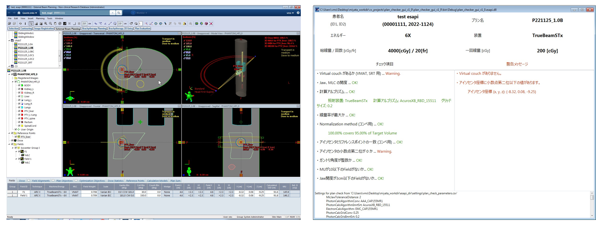
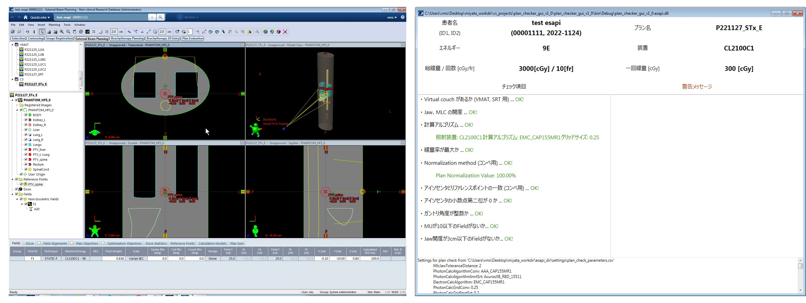

# plan_checker_gui_esapi_v15_5

ESAPI Binary Plugin for checking plan.

Checks a plan for technical problems before irradiating the patient.

Created to the extent possible with ESAPI v15.5.

This is in the process of i8n.

## Checklist

- Is the Virtual couch exist in the Structure Set (for VMAT/stereotactic irradiation)?

- Is the Jaw aperture wider than the MLC opening within the set value range (see [Setup](##Setup))?
- Is the dose calculation algorithm used as specified?
- Is the dose rate the maximum value at the energy of the Field?
- Is the dose 100% prescribed at the Isocenter (for conventional irradiation)?
- Do the coordinates of the Isocenter and Reference point match (for conventional irradiation)?
- Is the second decimal place of the Isocenter coordinate 0?
- Is the gantry angle an integer value?
- Are there any fields with MU less than 10?
- Are there any fields with Jaw opening less than 3 cm?

## How to use

With a plan you want to check open, run plan_checker_gui_esapi_v15_5.esapi.dll from Tools > Scripts.

### Setup

The [plan_check_parameters.csv](https://github.com/akiaji-k/plan_checker_gui_esapi_v15_5/blob/main/plan_check_parameters.csv) file allows you to edit the check items settings.

The editable items are listed below.

- Upper limit for the difference between Jaw and MLC opening
- Dose calculation algorithm and grid size for conventional irradiation
- Dose calculation algorithm and grid size for IMRT and stereotactic irradiation
- Dose calculation algorithm and grid size  for electron beams
- Dose rate for energy, corresponding to the linear accelerator
- Comment of the Virtual Couch corresponding to the linear accelerator

Each item can be set in duplicate to allow multiple values.

## Execution examples

The following execution examples are performed on a plan that dares to create an error.

If a warning occurs, as shown below, this information is displayed in the window on the right-hand side.

### Conventional 

### VMAT/stereotactic irradiation

### Electron beam

## LICENSE

Released under the MIT license.

No responsibility is assumed for anything that occurs with this software.

See [LICENSE](https://github.com/akiaji-k/plan_checker_gui_esapi_v15_5/blob/main/LICENSE) for further details.